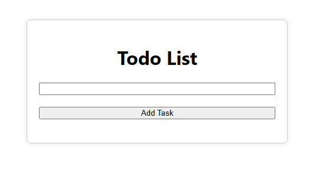

# Todo List App

## Description
A simple Todo List application built with React and TypeScript.

## Features
- Display a list of tasks with checkboxes.
- Add a new task.
- Mark a task as completed.
- Delete a task.

## Installation
1. Clone the repository.
2. Run `npm install` to install dependencies.
3. Run `npm start` to start the development server.

## Usage
- Add tasks using the input field.
- Mark tasks as completed by checking the checkboxes.
- Delete tasks using the delete button.

## Screenshots

